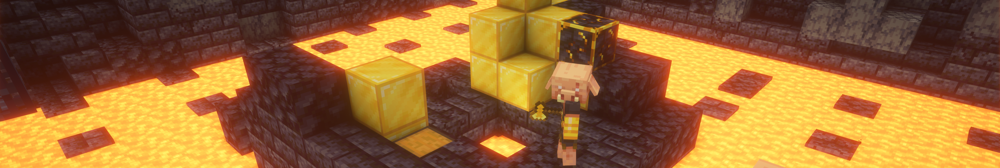

# Hi there! I'm Mythic 👋

I'm a developer focused on building tools and games for macOS, managing Minecraft communities, and developing web experiences. I spend most of my time in **Vim**, working across Swift, Java, and PHP.

---

### 🛠 Tech Stack & Projects

#### 🍎 Apple Ecosystem (Swift)
* **[Project-Hydra](https://github.com/MythicSorcerer/Project-Hydra):** Developing macOS games and utility tools with a focus on performance and native experience.
* **[Azox-Macros](https://github.com/MythicSorcerer/Azox-Macros):** Building my own autoclicker with bonus features I always thought an autoclicker should have.

#### 🎮 Minecraft & Backend (Java)
* **[azox-utils](https://github.com/MythicSorcerer/azox-utils):** A comprehensive "vibe code" plugin that consolidates essential features from multiple mods into one streamlined tool.
* **[nbt-editor](https://github.com/MythicSorcerer/nbt-editor):** Direct NBT manipulation for server-side management.

#### 🌐 Web Development (PHP & JS)
* **[azox.net](https://azox.net):** My personal hub and project home.
* **[xenon-www](https://github.com/MythicSorcerer/xenon-www):** A futuristic web interface built with PHP.

---

### ⚡ Fun Fact
Posting large projects to GitHub comes with an inherent security risk. I once accidentally pushed my Discord bot token and MaxMind key—I received three "stop what you're doing" emails from Discord, MaxMind, and GitHub within five minutes. Lesson learned: `.gitignore` exists for a reason.

### 📫 Reach Me
* **Discord:** `mythic_sorcerer`
* **Email:** [mythicsorcerer@gmail.com](mailto:mythicsorcerer@gmail.com)
* **Minecraft:** Join me at the same IP as my website!

---
